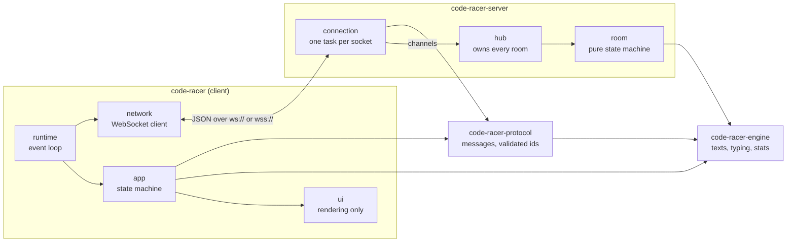

# Architecture

The workspace is split so that everything that can be tested without a terminal or a network is.



| Crate                                 | Responsibility                                                                |
| ------------------------------------- | ----------------------------------------------------------------------------- |
| [`code-racer`](../src)                   | the TUI client: event loop, state machine (`app/`), rendering (`ui/`), files  |
| [`code-racer-engine`](../crates/engine)  | text generation, typing session, statistics; no terminal, no network, no clock |
| [`code-racer-protocol`](../crates/protocol) | versioned wire messages, validated `RoomCode` / `Username`, room views, ranking |
| [`code-racer-server`](../crates/server)  | race server: connection handling, hub, room state machine                     |

## Source tree

```text
src/                client
  main.rs           startup: command line, files, logging
  runtime.rs        event loop: keyboard, network and clock events, redraw on change
  terminal.rs       raw mode, alternate screen, restoration on exit and panic
  app/              state machine, independent of rendering
    mod.rs          App: buffers, focus, modes, viewport, what the screen needs
    keys.rs         key handling by context      actions.rs        what users can do
    palette.rs      command palette, fuzzy match mouse.rs          clicks and wheel on what was drawn
    ink.rs          when each character was typed, the characters missed
    mascot.rs       the mood of the mascot
    events.rs       network, clock, paste, quiet period after typing
    practice.rs     solo plans and sessions      race.rs           room client and race rules
    text_settings.rs  lines shared by practice.toml and race.toml
    changes.rs      settings changes and saving  saved_config.rs   saved vs run-only settings
    command.rs      `:` commands                 form.rs, input.rs, settings.rs, help.rs, history_log.rs
  ui/               rendering only
    chrome.rs       explorer, tab line, status line, command line
    editor.rs       buffer with line numbers     typing.rs         ghost text and typed text
    looks.rs        what prose is dressed as     mascot.rs         the pixel-art ghost
    icons.rs        file icons by kind of file
    overlay.rs      the command palette          hits.rs           where clicks land
    views/          practice/race/config forms, session, room, history, help
    format.rs, wrap.rs, syntax.rs, chart.rs, theme.rs
  config.rs, history.rs, persist.rs, cli.rs, network.rs, logging.rs
crates/engine       texts and typing, no terminal, no network
  corpus/           word lists, quotes, code snippets (embedded at compile time)
  language.rs       natural and programming languages, one table of names each
  normalize.rs      turns any text into characters a keyboard can type
  words.rs          sentence-aware word generator (punctuation, numbers)
  text.rs           TextSource: words, quote or code, seeded
  session.rs        TypingSession: graphemes, mistakes, auto-indent, timing
  indentation.rs    which characters auto-indent fills in
  stats.rs          Tally, WPM, accuracy, consistency, per-second samples
crates/protocol     WebSocket messages, validated RoomCode and Username, room views and ranking
crates/server       race server
  room.rs           pure room state machine (lobby, countdown, race, results)
  hub.rs            single task owning every room, no locks
  connection.rs     one task per socket: handshake, limits, rate limiting
  peers.rs          connections held by each address
tests/e2e/          real binaries in pseudo-terminals
```


## Design decisions

| Decision | Why | Trade-off |
| --- | --- | --- |
| **Event-driven client.** It sleeps until a key, a network message or, only during a session, a 100 ms tick; it redraws after a change, or every 40–100 ms while something animates. | No CPU use while idle, which matters for a tool that sits open all day. | Animations need explicit scheduling instead of a fixed frame loop. |
| **App state separate from rendering.** `app/` never draws; `ui/` never mutates. | Every screen can be rendered in tests, in every theme and size, from a plain `App` value. | Mouse hit-testing needs a map of what was drawn (`ui/hits.rs`). |
| **Pure engine with injected time.** | Typing rules and statistics are deterministic and tested to the millisecond without a terminal. The server reuses the exact same code. | Callers own the clock. |
| **One hub task owns every room**, fed by channels from per-connection tasks. | No lock is ever held across an `.await`; no deadlocks, no contention bugs. | A single task serialises room updates, ample for LAN-sized traffic. |
| **Room logic is a pure state machine.** | Every rule (lobby, countdown, race, results, host hand-over) is tested with simulated time. | I/O lives at the edges, in `hub.rs` and `connection.rs`. |
| **Versioned, tagged JSON protocol** (`Hello` / `Welcome` handshake, currently v3). | Easy to debug with any WebSocket tool; mismatched peers get a clear error rather than undefined behaviour. | Slightly larger than a binary format, irrelevant at this scale. |
| **Validate at the boundary.** `RoomCode` and `Username` can only be built valid, at decode time. | Invalid input never reaches room logic. | — |
| **Corpus embedded at compile time.** | A single self-contained binary, no runtime data files to lose. | Adding texts means rebuilding. |

